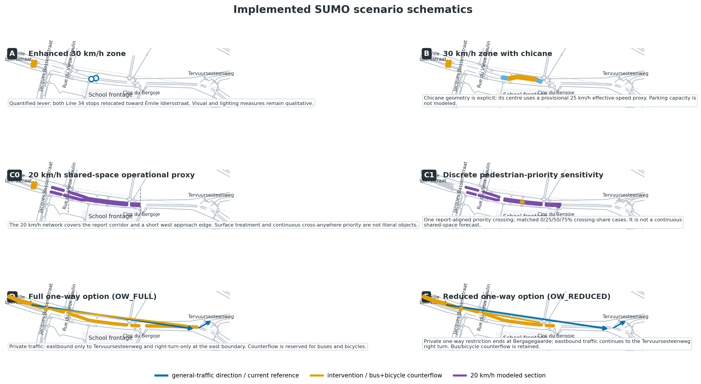

# Evidence-aligned SUMO school-street scenarios

Publication-support repository for the calibrated school-corridor SUMO model developed for the PROBONO Brussels Living Lab. The repository translates the 2025 road-safety inspection and a supplementary mobility-expert presentation into an auditable baseline, three report scenarios, two supplementary one-way scenarios, and bounded sensitivity experiments.

The repository supports reproducibility and traceability. It does **not** treat simulation outputs as measured crash-risk reductions, and it does not claim that every physical design feature can be represented literally in SUMO.

## Start here

- Technical guidebook: [PDF](docs/SUMO_School_Streets_Guidebook_v1.1.pdf), [editable DOCX](docs/SUMO_School_Streets_Guidebook_v1.1.docx), and [Markdown source](docs/GUIDEBOOK.md). It covers the evidence hierarchy, baseline construction, scenario-by-scenario implementation, limitations, KPI comparability, and rerun instructions.
- [Scenario requirements matrix](evidence/scenario_requirements.csv): every source requirement and its implementation status.
- [Evidence traceability matrix](analysis/evidence_traceability.csv): source statement, model lever, and evidence boundary.
- [Technical results summary](analysis/technical_results_summary.md): five-seed outputs and sensitivity results.
- [Validation report](analysis/validation_report.md): automated checks and disclosed warnings.
- [SUMO runtime migration note](docs/RUNTIME_MIGRATION_SUMO_1.27.1.md): release 1.0.0 versus 1.1.0 results and interpretation.
- [Backend handover](docs/HANDOVER_BACKEND.md) and [frontend handover](docs/HANDOVER_FRONTEND.md): integration guidance updated for the validated model.

## Scenario set

| Public label | Technical case | Evidence source | Role in the study |
|---|---|---|---|
| Baseline | `current` | Sensor data, OSM-derived network and public transport topology | Calibrated reference |
| Scenario A | `A_OBS` | Road-safety report, Section 6.1 | Primary report scenario; bus-stop relocation quantified, visual package qualitative |
| Scenario B | `B_OBS` | Road-safety report, Section 6.2 | Primary report scenario; chicane and bus-stop relocation quantified |
| Scenario C0 | `C_OBS` | Road-safety report, Section 6.3 | Primary 20 km/h shared-space operational proxy |
| Scenario C1 | `C1_X0/L25/M50/H75` | Report intent plus model sensitivity | Supplementary discrete pedestrian-priority sensitivity |
| Scenario D | `OW_FULL_OBS` | Mobility-expert presentation, slide 3 | Supplementary full one-way corridor experiment |
| Scenario E | `OW_REDUCED_OBS` | Mobility-expert presentation, slide 4 | Supplementary reduced one-way corridor experiment |
| Demand response | `*_DR15`, `*_DR30` | Assumption only | Sensitivity; never presented as a predicted design effect |

Scenarios A–C originate in the road-safety report. Scenarios D and E were supplied separately by the mobility expert and are retained as public display labels for continuity; the code uses `OW_FULL` and `OW_REDUCED` to prevent them from being mistaken for report scenarios.



## Baseline at a glance

The 24-hour reference uses the first 96 fifteen-minute bins for 1 October 2025:

- 7,597 passenger cars;
- 696 residual trucks and 107 Line 34 buses, totaling the observed 803 large vehicles;
- 755 bicycles and 210 motorcycles, totaling the observed 965 two-wheelers;
- 1,528 pedestrians;
- a five-seed mean of 36.34% of motorized passages above 36 km/h against the report target of 37%.

The sensor provides totals but no direction, origin/destination, turn, or pedestrian-trajectory fields. Non-transit corridor traffic is therefore split evenly by direction within each time bin. This is an explicit structural assumption, not an observed fact.

Line 34 route and stop topology are OSM-derived. The original OSM Wizard frequency was replaced by 107 individual calls from a Wednesday 15 October 2025 GTFS feed: 54 toward Sainte-Anne and 53 toward Porte de Namur. This is a near-date weekday proxy for the 1 October sensor day, not an exact-date timetable.

## Interpretation guardrails

- Compare Baseline, A, B and C0 directly at full observed demand.
- Compare C1 crossing cases only against `C1_X0`, because building the real crossing also changes network geometry.
- Use D/E results for school-frontage passages, spot speed, bus/bicycle permeability, and run stability. Do not interpret their total VKT, trip time, or emissions as complete neighbourhood effects because private westbound diversion continues outside the clipped network.
- Treat `DR15` and `DR30` as response envelopes applied to cars, trucks and motorcycles. Buses, bicycles and pedestrians remain fixed.
- Treat SUMO collision/overlap and SSM outputs as uncalibrated diagnostics, not observed or predicted crashes.
- Treat emissions as SUMO/HBEFA tailpipe estimates under declared fleet assumptions.

## Reproduce the experiment

Exact reproduction of this release requires SUMO 1.27.1 and Python 3.10 or newer. The scripts use the Python standard library; `matplotlib` is needed only to regenerate the schematics.

```bash
python3 -m pip install -r requirements.txt
bash scripts/run_all.sh --sumo-binary /path/to/sumo
```

The full workflow prepares 20 cases, executes seeds 42–46, runs the fleet boundary analysis, extracts results, and validates the package. The current release passes 307 automated checks, with 10 disclosed evidence warnings and no failures. `scripts/prepare_experiment.py` recreates generated case folders from `templates/`; run it in a clean clone or working copy if the archived canonical outputs must be preserved.

For a smaller targeted run:

```bash
python3 scripts/prepare_experiment.py
python3 scripts/run_experiment.py \
  --sumo-binary /path/to/sumo \
  --scenarios current A_OBS B_OBS C_OBS \
  --seeds 42 43 44 45 46
python3 scripts/extract_results.py
python3 scripts/validate_package.py
```

## Repository layout

```text
analysis/              Processed KPIs, calibration checks and validation
docs/                  Guidebook, handovers, figures and release checklist
evidence/              Source register, traceability and derived timetable
scripts/               Preparation, simulation, extraction and validation
templates/             Immutable SUMO source templates
current/ and *_OBS/    Canonical full-demand cases in the archival package
*_DR15 and *_DR30/     Demand-response sensitivity cases
C1_*/                  Pedestrian-priority sensitivity cases
tested_alternatives/   Experiments evaluated but not adopted as primary models
```

The lean GitHub package omits generated case folders and raw simulation outputs; running the preparation and experiment scripts recreates them. The archival package retains the validated canonical outputs for deposit.

## Source-document policy

The supplied road-safety report and mobility presentation are referenced by filename, page/slide, and SHA-256 checksum but are not redistributed here pending confirmation of public-release rights. The scenario schematics are generated directly from the validated SUMO networks and contain no third-party basemap imagery.

See [PUBLIC_RELEASE_CHECKLIST.md](docs/PUBLIC_RELEASE_CHECKLIST.md) before creating the GitHub release or Zenodo record.

## Version

Repository release: **1.1.0**  
Validated model lineage: **v21.2** (the v21.1 evidence-aligned model regenerated and validated with SUMO 1.27.1), with the v22 bounded-diversion experiment retained only as a tested alternative. Release 1.0.0 remains the historical SUMO 1.24.0 snapshot.
