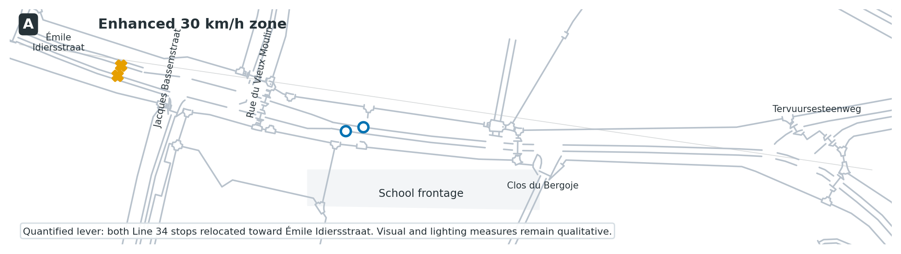
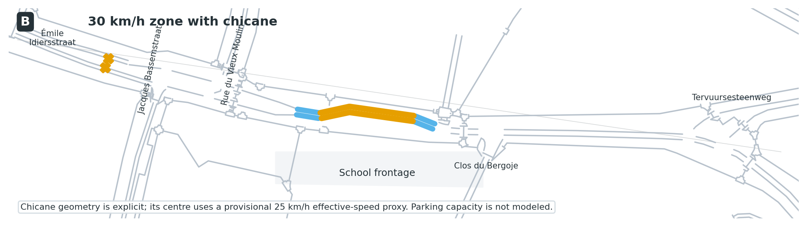
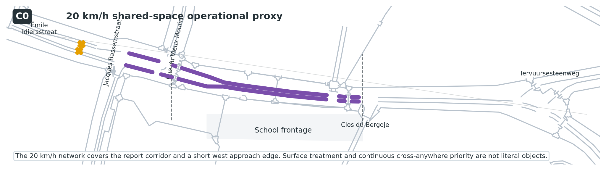
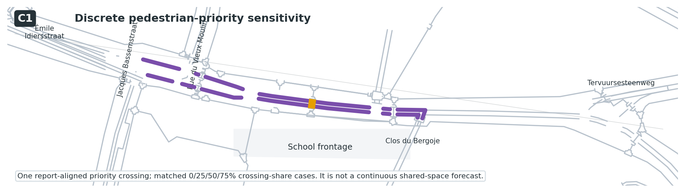
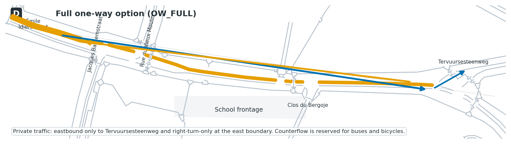
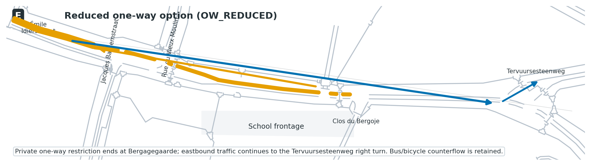

# SUMO School-Street Scenario Guidebook

**Evidence-aligned baseline, intervention models, sensitivities and publication boundary**  
Repository release 1.1.0 · Model lineage v21.2 · 14 August 2026  
PROBONO H2020 · Brussels Living Lab · De l’Autre Côté de l’École, Auderghem

## Executive summary

This guidebook documents how a calibrated SUMO model was constructed for the school corridor on Chaussée de Wavre/Waversesteenweg and how the proposed interventions were translated into simulation levers. Its purpose is to make the eventual article, GitHub repository and Zenodo deposit auditable: a reader should be able to distinguish the source design, the implemented model, an explicit proxy, a sensitivity assumption, and an unmodeled requirement.

The final evidence structure is:

1. **Baseline** — a sensor-aligned, 24-hour corridor-boundary reference for 1 October 2025.
2. **Scenarios A, B and C0** — the primary scenario family derived from Sections 6.1–6.3 of the 2025 road-safety inspection.
3. **Scenario C1** — a supplementary pedestrian-priority sensitivity, evaluated only against its matched network control.
4. **Scenarios D and E** — supplementary one-way concepts supplied separately in a mobility-expert presentation. They are corridor access experiments, not full neighbourhood diversion forecasts.
5. **DR15 and DR30** — explicit motorized-demand-response sensitivities, not consequences predicted from a street design.
6. **Expanded one-way diversion model** — a tested but non-adopted alternative retained as an audit record because its surrounding demand and route choices could not be calibrated.
7. **Runtime migration** — all 20 cases were regenerated and rerun under SUMO 1.27.1; the prior 1.24.0 values remain a historical release and are not mixed with the new evidence layer.

The package does not claim that SUMO predicts crash counts or that proxy implementations reproduce the complete public-realm design. Baseline, A, B and C0 can be compared directly at full observed demand. C1 must be compared with `C1_X0`. D and E support only corridor-level passage, speed, permeability and stability conclusions; their off-network diversion time, distance, congestion and emissions are outside the model boundary.

## 1. Study question and model boundary

The planning question is local:

> How do alternative street-design and access-management concepts affect mobility operation around the school frontage under a common observed demand profile?

The model is therefore a **school-corridor microsimulation**, not a calibrated traffic-assignment model for Auderghem. The modeled boundary is deliberately small enough to remain aligned with the sensor evidence and the safety-report intervention area.

The model can estimate, within that boundary:

- passage counts at the school-frontage observation point;
- spot-speed distributions;
- vehicle travel and delay within represented routes;
- bus stopping and time loss;
- discrete pedestrian-crossing interaction in C1;
- route-based tailpipe emissions under declared fleet assumptions;
- operational completion, teleports and simulation diagnostics.

It cannot establish, without additional evidence:

- complete neighbourhood route choice or diverted traffic assignment;
- parking search, occupancy or kerb-use effects;
- behavioral responses to markings, lighting, murals or school branding;
- pedestrian desire lines or continuous cross-anywhere movement;
- actual yielding compliance;
- crash frequency or injury severity;
- before/after safety effectiveness.

## 2. Evidence hierarchy and interpretation rules

### 2.1 Source priority

The following hierarchy was used when translating the interventions:

1. **Final road-safety inspection** for the intent and requirements of Scenarios A–C.
2. **Mobility-expert presentation** for the separately proposed one-way Options A and B and for spatial clarification of the bus-stop/chicane concepts.
3. **Validated SUMO files** for the exact numerical and topological implementation.
4. **Declared assumptions and sensitivities** only where no observed parameter was supplied.

Where a source concept could not be modeled without inventing a response coefficient, it remains qualitative. A limitation was not converted into a hidden parameter.

### 2.2 Source discrepancies

| Issue | Road-safety report | Mobility presentation | Repository treatment |
|---|---|---|---|
| Parking removed for B | Six north-side spaces | Five spaces on slide 2 | Report wording has priority. No parking capacity is simulated because the baseline has no `parkingArea` objects. |
| Bus-stop relocation | Both stops could move toward Émile Idiersstraat | Slide 1 provides the map concept | Both active Line 34 stops are relocated; this is the only numerical lever in A. |
| One-way options | Not included | Options A and B on slides 3–4 | Retained as supplementary Scenarios D/E, technically named `OW_FULL`/`OW_REDUCED`. |
| Rue du Vieux Moulin direction | No D/E requirement | Orange arrow is labeled as a change | The imported network already permits the indicated northbound motor direction; no unsupported reversal is added. |
| Shared-space crossing | Pedestrians may cross anywhere and vehicles yield everywhere | No separate construction drawing | C0 is a 20 km/h operational proxy. C1 tests one real priority crossing at 0/25/50/75% crossing shares. |

### 2.3 Implementation status vocabulary

- **Modeled** — a direct network, route, permission, stop or demand lever exists.
- **Proxy** — the design intent is represented through a bounded operational analogue.
- **Sensitivity** — an unobserved parameter is varied across a declared range.
- **Qualitative** — the requirement is documented but no numerical effect is assigned.
- **Outside scope** — the required network or evidence is absent and no substitute is invented.
- **Tested but not adopted** — an alternative implementation was run and retained as an audit, but is not suitable for the primary evidence layer.

## 3. Baseline construction

### 3.1 Network and simulation period

The local network originated from SUMO’s OSM Web Wizard workflow and was curated for the school corridor. The experiment runs over 86,400 seconds. The model uses the first 96 fifteen-minute bins of the supplied October 2025 count table, corresponding to 1 October 2025.

OSM-derived files provide road topology and the Line 34 route/stop topology. They do not, by themselves, reproduce the calibrated study. The repository adds sensor-based demand, timetable reconstruction, speed calibration, fleet assumptions, scenario networks, multi-seed execution and validation.

### 3.2 Observed demand

| Mode represented | Daily count | Model treatment |
|---|---:|---|
| Passenger cars | 7,597 | Individual corridor-boundary trips |
| Large vehicles | 803 | 107 buses plus 696 residual trucks |
| Bicycles | 755 | Assumed 90% of two-wheelers |
| Motorcycles | 210 | Assumed 10% of two-wheelers |
| Two-wheelers, observed total | 965 | Bicycle/motorcycle split is a model assumption |
| Pedestrians | 1,528 | Frontage-sidewalk exposure paths in Baseline/A/B/C0; nested crossing shares in C1 |

The input departure count is exact within every fifteen-minute bin. Passage time at the detector can shift to an adjacent output bin because vehicles require time to reach the detector and may queue. Daily detector totals remain exact for cars, large vehicles and two-wheelers. The repository therefore distinguishes **exact input-bin representation** from **output-bin passage timing**.

### 3.3 Direction and origin/destination assumption

The count table contains no direction, origin, destination or turning-movement fields. Non-transit demand is consequently split evenly by direction within each time bin and assigned fixed corridor-boundary origin/destination pairs. Scheduled buses retain their timetable direction.

This assumption is appropriate for a bounded corridor experiment, but it has two important consequences:

- it is not a network-wide demand model;
- the modeled D/E frontage reduction follows the assumed westbound share and is not a measured diversion forecast.

An analytical 40–60% directional envelope may be discussed for D/E, but additional microsimulation runs would not resolve the missing observation.

### 3.4 Public transport

The OSM Wizard supplied Line 34 route and stop topology but generated a regular 600-second service frequency through `ptlines2flows.py`. That frequency is a generation default, not the operator timetable.

The validated model replaces it with 107 individual calls from a publicly downloadable Wednesday 15 October 2025 GTFS feed:

- 54 calls toward Sainte-Anne/Sint-Anna;
- 53 calls toward Porte de Namur/Naamsepoort;
- operation restricted to the 07:30–19:30 calibration window;
- one corridor traversal per modeled bus;
- 20-second minimum stop duration plus schedule holds.

The source date is close to but not identical with the 1 October sensor date. An exact-date archived feed was identified in metadata, but its raw file was access-restricted. The repository therefore labels the service as a **near-date weekday timetable proxy**.

No passenger boarding or alighting demand is modeled. Bus results describe vehicle operation and stopping only.

### 3.5 Large-vehicle reconciliation

The 803 observed large vehicles are not added on top of the buses. Each scheduled bus passage is allocated to its corresponding fifteen-minute bin, and the remaining large-vehicle count is assigned to trucks. The resulting model contains 107 buses and 696 trucks, preserving 803 large-vehicle passages exactly.

### 3.6 Speed calibration

The report states that 37% of motorized vehicles exceeded 36 km/h in September 2024. A common desired-speed distribution was fitted to this secondary aggregate target:

```text
normc(1.372, 0.20, 0.75, 2.00)
```

Across seeds 42–46, the baseline produces 36.34% above 36 km/h, an error of −0.66 percentage points. All designs use the same calibrated driver population; design comparisons are not created by assigning different driver aggressiveness to each scenario.

### 3.7 Bicycle interaction

All cases use a common 0.8 m sublane resolution so car–bicycle interaction is not changed by inconsistent simulation settings. No field observations were available to calibrate overtaking gaps or bicycle lane-changing behavior.

### 3.8 Fleet and emissions

Passenger-car fuel shares are anchored to Statbel’s Belgian vehicle stock of 1 August 2025. The repository maps those shares deterministically to HBEFA4 classes. Euro stage, local traffic-fleet transfer, truck class, bus class and motorcycle class remain assumptions because the source does not provide local age or Euro-stage distributions.

The reported emissions are SUMO/HBEFA tailpipe estimates. They exclude non-exhaust particles, vehicle manufacture, infrastructure construction and upstream energy. A conservative passenger Euro-stage boundary test is included because absolute NOx is particularly sensitive to that mapping.

### 3.9 Replication and completion rule

Each principal case is run with seeds 42–46. A replicate contributes to reported means only if every loaded vehicle completes. Observed-demand cases must complete without jam/yield teleports. C1 intermodal overlaps are disclosed as diagnostics. D/E require zero collision diagnostics in their adopted corridor formulation.

## 4. Scenario taxonomy

`OBS` means that the full observed input profile is retained. `DR15` and `DR30` remove 15% or 30% of cars, trucks and motorcycles through a deterministic, time-bin/direction-preserving filter. Buses, bicycles and pedestrians remain fixed.

| Design family | Full-demand case | Additional cases | Evidential role |
|---|---|---|---|
| Baseline | `current` | — | Calibrated reference |
| A | `A_OBS` | `A_DR15`, `A_DR30` | Report scenario plus demand sensitivities |
| B | `B_OBS` | `B_DR15`, `B_DR30` | Report scenario plus demand sensitivities |
| C0 | `C_OBS` | `C_DR15`, `C_DR30` | Primary shared-space operational proxy plus demand sensitivities |
| C1 | `C1_X0` | `C1_L25`, `C1_M50`, `C1_H75` | Matched crossing-share sensitivity |
| D | `OW_FULL_OBS` | `OW_FULL_DR15`, `OW_FULL_DR30` | Supplementary one-way corridor experiment |
| E | `OW_REDUCED_OBS` | `OW_REDUCED_DR15`, `OW_REDUCED_DR30` | Supplementary reduced one-way corridor experiment |

## 5. Scenario A — enhanced 30 km/h zone



### Source intent

Section 6.1 retains the 30 km/h limit and general street design. It proposes renewed pavement markings, better-positioned signage, murals or coloured ground patterns, improved lighting, removal or relocation of sightline obstacles, possible traffic-flow reorganization to deter through traffic, and possible relocation of both bus stops toward Émile Idiersstraat.

### SUMO implementation

- Current road network and 30 km/h speed environment retained.
- Both active Line 34 stops relocated toward Émile Idiersstraat in both directions.
- All 107 timetable-proxy buses retained.
- Full observed demand retained in `A_OBS`.
- No behavioral speed-reduction coefficient assigned to visual measures.
- No signal, turn or flow-direction reorganization implemented.
- `A_DR15` and `A_DR30` test demand response separately.

### Correct interpretation

`A_OBS` quantifies the operational consequences of **bus-stop relocation under unchanged driver behavior**. It is not a numerical representation of the full visibility and branding package. The full-demand result can therefore show higher free-flow speed even though the source concept expects greater caution; that difference is evidence of the model boundary, not a reason to invent a visual-calming coefficient.

## 6. Scenario B — 30 km/h zone with chicane



### Source intent

Section 6.2 retains the 30 km/h limit, removes six north-side parking spaces and inserts a chicane. Both bus stops may be relocated toward Émile Idiersstraat, and freed space may support a wider sidewalk, loading, drop-off or a school square. Slide 2 of the mobility presentation refers to five parking spaces; the final report’s six-space wording is treated as authoritative.

### SUMO implementation

- Explicit lateral chicane geometry in both directions.
- 30 km/h outer chicane sections.
- Provisional 25 km/h (`6.94 m/s`) effective speed on the central chicane section.
- Both active bus stops relocated as in A.
- Full observed demand in `B_OBS`.
- Common calibrated driver distribution retained.

### Not modeled

- Parking supply, occupancy, parking search or displaced parking demand.
- A numerical five- or six-space capacity effect.
- Flexible kerb uses, loading, drop-off or the school-square program.
- Visual treatment and lighting response.

The baseline contains no SUMO `parkingArea` objects. The removed spaces are therefore interpreted as geometric clearance for the chicane, not as a simulated parking-capacity intervention.

## 7. Scenario C0 — 20 km/h shared-space operational proxy



### Source intent

Section 6.3 proposes a `zone de rencontre` between Clos du Bergoje and Rue du Vieux Moulin:

- maximum speed of 20 km/h;
- raised, curbless and visually distinct surface;
- removal of crosswalks;
- pedestrian priority everywhere and crossing anywhere;
- permanent parking removal;
- relocation of both stops toward Émile Idiersstraat;
- possible signal or junction reconfiguration.

### C0 implementation

- 20 km/h (`5.56 m/s`) on the corridor edges used by the supplied C network.
- The report core and a short west approach edge are covered because the operational network boundary is discretized by imported edge segments.
- Both active bus stops relocated.
- Full observed road-user totals retained.
- Cyclists remain mixed with motor traffic under the same sublane model.
- Pedestrians remain on two frontage-sidewalk exposure paths.
- Current traffic-signal programs are retained.

### C0 interpretation

C0 estimates the motor-vehicle and bus consequences of a low-speed shared-space corridor. It does not model a continuous public surface, construction material, elevation, parking supply, pedestrian crossing everywhere, universal vehicle yielding or signal removal. It is the primary Scenario C case because it has the strongest direct comparability with Baseline/A/B while avoiding unsupported pedestrian trajectories.

## 8. Scenario C1 — discrete pedestrian-priority sensitivity



The supplied C geometry contained a decorative mid-block pedestrian link that was not a SUMO crossing. C1 converts this location into one real priority crossing by splitting the carriageway and rebuilding the junction.

### Matched cases

| Case | Pedestrians routed across | Purpose |
|---|---:|---|
| `C1_X0` | 0 | Identical rebuilt-network control |
| `C1_L25` | 382 (25%) | Low crossing-share assumption |
| `C1_M50` | 764 (50%) | Medium crossing-share assumption |
| `C1_H75` | 1,146 (75%) | High crossing-share assumption |

The selections are nested, and vehicle demand is unchanged. Because the network rebuild changes edge lengths and approach behavior even at 0% crossing, pedestrian effects must be calculated as C1_L25/M50/H75 versus C1_X0. C0 versus C1_X0 is not a pedestrian-effect comparison.

### C1 envelope

Relative to `C1_X0`, the 25–75% crossing-share cases:

- reduce spot speed by approximately 3.3–10.1%;
- increase CO₂ per VKT by approximately 0.6–1.8%;
- add approximately 0.27–0.92 seconds of mean bus time loss;
- produce approximately 5.6–10.8 SUMO intermodal overlap diagnostics per run.

Those diagnostics are geometry/time-step events, many involving bicycles. They are not crashes and are not evidence that the design is safe or unsafe. C1 demonstrates operational sensitivity to assumed pedestrian interaction; it does not validate a continuous shared space.

## 9. Scenario D — full one-way option (`OW_FULL`)



### Source intent

Mobility-expert slide 3 makes Chaussée de Wavre one-way for private cars between Émile Idiersstraat and Tervuursesteenweg. Buses remain possible in both directions, with buses and bicycles sharing the counterflow lane. Eastbound private cars turn right at Tervuursesteenweg.

### SUMO implementation

- Private motor traffic permitted eastbound only over the full stated extent.
- Westbound lanes restricted to buses and bicycles.
- All 107 buses and all bicycle IDs retained in both directions.
- Eastbound private traffic follows the right-turn-only boundary route at Tervuursesteenweg.
- Existing northbound motor direction on Rue du Vieux Moulin retained because it already matches the slide arrow.
- Current bus-stop locations retained; bus relocation and the chicane are separate concepts in the presentation.
- No chicane added.

### Diversion boundary

The clipped network contains no connected external bypass. Every prohibited westbound private vehicle remains an input, approaches the closure and exits at the Tervuursesteenweg boundary. Its onward route, travel time, distance, congestion and emissions are not modeled.

`OW_FULL_OBS` therefore supports conclusions about school-frontage passages, spot speed, bus/bicycle permeability and local completion. It does not support a complete emissions or neighbourhood travel-time comparison with the baseline.

## 10. Scenario E — reduced one-way option (`OW_REDUCED`)



### Source intent

Mobility-expert slide 4 shortens the private-car one-way section so it ends at Bergagegaarde/Clos du Bergoje. Buses and bicycles retain two-way access. The slide also repeats the east-end instruction that cars may only turn right at Tervuursesteenweg.

### SUMO implementation

- Private motor traffic eastbound only between Émile Idiersstraat and Bergagegaarde.
- Westbound lanes within that section restricted to buses and bicycles.
- Eastbound private traffic continues through the unchanged two-way section east of Bergagegaarde and turns right at Tervuursesteenweg.
- Current stops retained and no chicane added.
- Westbound private traffic approaches from the east, reaches Bergagegaarde and exits at the closure boundary.

The same corridor-level interpretation applies as in D. The modeled frontage reduction is driven by the access rule and the balanced directional assumption. It is not a forecast that the same proportion of traffic disappears from the neighbourhood.

## 11. Demand-response sensitivities

The safety report recommends considering traffic-flow reorganization, but the sensor does not identify local and through traffic. The repository therefore does not assign a traffic reduction to a physical design.

Instead, DR15 and DR30 apply a deterministic reduction to:

- passenger cars;
- trucks;
- motorcycles.

They keep fixed:

- all 107 buses;
- all 755 bicycles;
- all 1,528 pedestrians.

The filter preserves time-bin and direction structure as closely as integer counts permit. These cases answer a conditional question: “How would this design operate if non-transit motorized demand were 15% or 30% lower?” They do not answer how much demand the intervention will remove.

## 12. Tested but not adopted: bounded one-way diversion

A compact expanded-network experiment tested whether D/E should include complete local diversion loops. It used the same 9,365 vehicles, five seeds and a matched expanded baseline.

The experiment was not promoted because:

- surrounding streets had no calibrated background traffic;
- every diverted vehicle was forced onto one unsupported route;
- the full option approximately doubled VKT within the chosen envelope;
- the reduced option more than doubled VKT and produced 29–52 junction-overlap diagnostics per run at Bergagegaarde;
- even the expanded baseline produced occasional geometry diagnostics.

The experiment confirms that off-corridor diversion is not “free,” but its absolute VKT, emissions, travel time and collision diagnostics are not publication-grade outcomes. It remains under `tested_alternatives/oneway_expanded/` as a model-scope decision record.

A future expanded model would require directional corridor counts, counts or calibrated demand on diversion streets, confirmed turn treatments, route-choice proportions, and a collision-free matched baseline.

## 13. KPI definitions and comparability

### 13.1 Main outputs

- **Motorized frontage passages** — vehicles detected at the school-frontage observation edge.
- **Spot speed** — motorized speed at that observation point.
- **Above 36 km/h** — share of motorized frontage passages exceeding the report threshold.
- **VKT** — sum of represented route distance, not necessarily complete real-world trip distance.
- **Trip duration, waiting, stops and time loss** — SUMO trip outputs within represented routes.
- **Bus time loss** — mean time loss for modeled Line 34 vehicles.
- **Tailpipe emissions** — SUMO/HBEFA totals for represented routes and declared vehicle classes.
- **Crossing wait** — waiting by C1 pedestrians routed through the priority crossing.
- **Hard-braking passage** — diagnostic speed loss of at least 2.5 m/s between consecutive one-second samples.
- **Collision/overlap diagnostic** — SUMO event output; not a field-calibrated crash indicator.

### 13.2 Comparison matrix

| Comparison | Frontage passages/speed | Route time/VKT/emissions | Pedestrian interaction | Valid interpretation |
|---|---|---|---|---|
| Baseline vs A/B/C0 at `OBS` | Yes | Yes, within the common clipped study boundary | No crossing effect | Primary design comparison |
| C1_L/M/H vs C1_X0 | Yes | Yes, matched C1 network | Yes, conditional | Pedestrian-interaction sensitivity |
| C0 vs C1_X0 | Descriptive only | No causal pedestrian reading | No | Network-rebuild difference is confounded |
| Baseline vs D/E | Yes, corridor-level | No complete comparison | No | Access/permeability experiment |
| OBS vs DR15/DR30 within a design | Yes | Yes, conditional | Fixed | Demand-response envelope, not forecast |
| Expanded v22 alternatives | Audit only | Do not use | No | Feasibility/model-scope record |

### 13.3 Full-demand headline values

| Case | Valid seeds | Frontage passages | Spot speed | Above 36 km/h | CO₂ | Interpretation boundary |
|---|---:|---:|---:|---:|---:|---|
| Baseline | 5/5 | 8,610 | 32.77 km/h | 36.34% | 878.1 kg | Reference |
| A | 5/5 | 8,610 | 35.27 km/h | 48.93% | 687.1 kg | Bus-stop relocation only |
| B | 5/5 | 8,610 | 29.27 km/h | 11.59% | 723.6 kg | Chicane proxy plus relocation |
| C0 | 5/5 | 8,610 | 22.35 km/h | 0.09% | 761.0 kg | 20 km/h operational proxy |
| D | 5/5 | 4,357 | 32.07 km/h | 39.97% | 747.9 kg* | Corridor access experiment |
| E | 5/5 | 4,357 | 32.06 km/h | 40.00% | 871.1 kg* | Corridor access experiment |

\*D/E CO₂ totals exclude onward off-network diversion and must not be presented as network-wide reductions.

The one-way options reduce modeled frontage passages under the balanced direction assumption but do not automatically calm the remaining traffic. Both leave the proportion above 36 km/h higher than in the baseline, implying that access filtering and speed management are distinct design questions.

## 14. Validation and known warnings

The validated model lineage passed 307 automated checks with 10 disclosed warnings and no failed checks. The checks cover:

- exact deterministic ID sets;
- demand counts and timetable count;
- route origin/destination definitions;
- network permissions;
- C1 split edges and crossing topology;
- common driver behavior and fleet assignment;
- five-seed completion and teleports;
- one-way collision diagnostics;
- analysis-table consistency;
- manifest integrity.

The disclosed warnings concern:

1. C1 network-rebuild scope;
2. near-date rather than exact-date Line 34 timetable;
3. absence of a parking-capacity model;
4. D/E diversion boundary;
5. directional-demand uncertainty;
6. fifteen-minute detector-time redistribution;
7. national-to-local fleet transfer and Euro-stage assumptions;
8. C1 intermodal overlap diagnostics;
9. absolute NOx sensitivity to Euro-stage mapping;
10. Scenario A’s qualitative visual/sightline scope.

Warnings are evidence boundaries, not failed runs. They must remain visible in the article and any platform integration.

## 15. Reproduction workflow

### 15.1 Environment

- SUMO 1.27.1 for exact reproducibility of release 1.1.0;
- Python 3.10 or newer;
- no non-standard Python dependency for the core workflow;
- `matplotlib` only for scenario schematics.

### 15.2 Full run

```bash
bash scripts/run_all.sh --sumo-binary /path/to/sumo
```

The command:

1. rebuilds all cases from immutable templates;
2. runs 20 cases across seeds 42–46;
3. runs the passenger Euro-stage boundary analysis;
4. extracts calibration, mobility, emissions and interaction outputs;
5. executes validation and writes the manifest.

The scenario definitions are unchanged from release 1.0.0, but runtime-derived networks and outputs were regenerated. Time-loss, emissions and some interaction diagnostics changed under SUMO 1.27.1; see [the migration note](RUNTIME_MIGRATION_SUMO_1.27.1.md) and do not mix values from the two releases.

`prepare_experiment.py` replaces generated case folders. Preserve the archival outputs by running in a clean clone or separate working directory.

### 15.3 Targeted run

```bash
python3 scripts/prepare_experiment.py
python3 scripts/run_experiment.py \
  --sumo-binary /path/to/sumo \
  --scenarios current A_OBS B_OBS C_OBS \
  --seeds 42 43 44 45 46
python3 scripts/extract_results.py
python3 scripts/validate_package.py
```

### 15.4 Regenerate maps

```bash
MPLCONFIGDIR=/tmp/matplotlib python3 scripts/plot_scenario_maps.py
```

The figures are generated from the model networks and intentionally omit third-party satellite or street-map imagery.

## 16. Repository packages

Two release forms are prepared:

- **GitHub-ready repository** — templates, scripts, processed results, guidebook, handovers and evidence records; generated raw outputs are omitted.
- **Archival/Zenodo package** — the same documentation plus canonical generated cases and outputs used for the processed results.

The supplied safety report and mobility presentation are not redistributed pending confirmation of public-release rights. Their filenames, page/slide references, sizes and SHA-256 checksums are recorded in `evidence/source_file_checksums.csv`.

## 17. Manuscript use

The repository should be cited as the source of model files, scenario translations and processed outputs. The manuscript should follow these boundaries:

- call A–C the road-safety-report scenarios;
- introduce D/E as supplementary mobility-expert concepts;
- describe A as a bus-stop-relocation simulation with qualitative visibility measures;
- describe B’s parking removal as a geometric design requirement, not a capacity model;
- call C0 a 20 km/h shared-space operational proxy;
- present C1 as a crossing-share sensitivity against `C1_X0`;
- restrict D/E inference to the school frontage and explicitly exclude downstream diversion impacts;
- identify DR15/DR30 as hypothetical response sensitivities;
- avoid interpreting SUMO overlap diagnostics as crashes or safety benefits.

The manuscript update should occur only after its scenario labels, tables, figures and conclusions are checked against this guidebook and the traceability matrix.

## Appendix A. Key files

| Need | File |
|---|---|
| Complete implementation narrative | `docs/GUIDEBOOK.md` |
| Source-to-model mapping | `evidence/scenario_requirements.csv` |
| Evidence register | `evidence/SOURCE_REGISTER.md` |
| Model-to-source traceability | `analysis/evidence_traceability.csv` |
| Calibration results | `analysis/calibration_validation.csv` |
| Five-seed results | `analysis/replicate_summary.csv` |
| C1 sensitivity | `analysis/scenario_C1_interaction_summary.csv` |
| D/E corridor results | `analysis/scenario_oneway_summary.csv` |
| Full technical summary | `analysis/technical_results_summary.md` |
| Validation status | `analysis/validation_report.md` |
| Runtime migration | `docs/RUNTIME_MIGRATION_SUMO_1.27.1.md` and `analysis/runtime_migration_v1.0_to_v1.1.csv` |
| Backend integration | `docs/HANDOVER_BACKEND.md` |
| Frontend content | `docs/HANDOVER_FRONTEND.md` |
| Release decisions | `docs/PUBLIC_RELEASE_CHECKLIST.md` |

## Appendix B. Terminology

- **Observed demand (`OBS`)** — full supplied daily passage profile used as input.
- **Demand response (`DR`)** — hypothetical non-transit motorized-demand reduction.
- **Operational proxy** — a bounded SUMO representation of selected physical-design effects.
- **Matched control** — a case with identical network geometry but without the varied interaction parameter.
- **Corridor boundary** — point where a route enters or exits the modeled local study area.
- **Frontage passage** — road user crossing the school-frontage observation point.
- **Tailpipe estimate** — exhaust emissions generated by the modeled route and HBEFA class.
